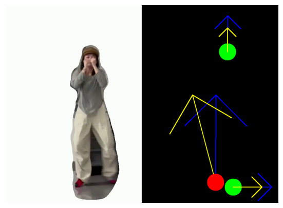

<h1>Computer Vision Project : Dancing Sync</h1>

<h3>Project Idea</h3>

Welcome to our project! Our goal is to automate the dancing game machine, typically operated by floor buttons, to track players' moves and performances solely through a camera. Specifically, our program starts by segmenting the players out of the background then detects key points of interest, such as hands and legs, tracks them, calculates accelerations and velocities for each point, estimates synchronization, and ultimately computes a performance score.

<h3>Video Preprocessing : Players Segmentation</h3>

When dealing with videos, separating moving objects from the background presents a relatively simpler challenge compared to standard image segmentation. This is because we can leverage temporal information regarding color changes in pixels, providing a decent approximation of the object to be segmented. Nevertheless, the mask generated by subtracting each frame from its subsequent one may still exhibit imperfections, as it only identifies a threshold of color change. To refine the segmentation and address this issue, we employed active contours on the resulting mask. This technique allows us to capture the convex curve that encompasses the desired object. (See results figure below for visualization).

<h3>Interest points detection </h3>

To accomplish this, we've simplified the task by assuming that players wear gloves and socks of a distinct color from the rest of their attire, a reasonable assumption within the context of this game. We employed straightforward color clustering to identify these key segments of interest, then computed their barycenters. Using the recorded positions in each frame, we derived velocity and acceleration vectors. These signals serve as direct indicators for evaluating move synchronization. By pinpointing temporal instances where there's a change in acceleration vectors (indicating a change in movement direction), we can compare these points with results from another video to assess synchronization.

The code is available from preprocessing to results in the notebook [chore_analysis.ipynb](./chore_analysis.ipynb)

